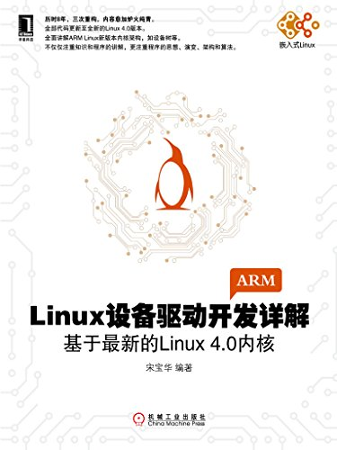

# 《Linux 设备驱动开发详解》(宋宝华) 学习笔记



## 本仓库说明

```
Something I hope you know before go into the coding~
* First, please watch or star this repo, I'll be more happy if you follow me.
* Bug report, questions and discussion are welcome, you can post an issue or pull a request.
```

* GitBook:<https://yifengyou.gitbooks.io/learn-LDDD/content/>
* GitHub:<https://github.com/yifengyou/learn-LDDD/>
* GitPage:<https://yifengyou.github.io/learn-LDDD/>

## 目录

* [Linux设备驱动概述及开发环境构建](docs/Linux设备驱动概述及开发环境构建.md)
    * [Linux设备驱动的开发环境构建](docs/Linux设备驱动概述及开发环境构建/Linux设备驱动的开发环境构建.md)
* [驱动设计的硬件基础](docs/驱动设计的硬件基础.md)
* [Linux内核及内核编程](docs/Linux内核及内核编程.md)
* [Linux内核模块](docs/Linux内核模块.md)
* [Linux文件系统与设备文件](docs/Linux文件系统与设备文件.md)
* [字符设备驱动](docs/字符设备驱动.md)
* [Linux设备驱动中的并发控制](docs/Linux设备驱动中的并发控制.md)
* [Linux设备驱动中的阻塞与非阻塞I/O](docs/Linux设备驱动中的阻塞与非阻塞IO.md)
* [Linux设备驱动中的异步通知与异步I/O](docs/Linux设备驱动中的异步通知与异步IO.md)
* [中断与时钟](docs/中断与时钟.md)
* [内存与I/O访问](docs/内存与IO访问.md)
* [Linux设备驱动的软件架构思想](docs/Linux设备驱动的软件架构思想.md)
* [Linux块设备驱动](docs/Linux块设备驱动.md)
* [Linux网络设备驱动](docs/Linux网络设备驱动.md)
* [Linux I2C核心、总线与设备驱动](docs/LinuxI2C核心总线与设备驱动.md)
* [USB主机、设备与Gadget驱动](docs/USB主机设备与Gadget驱动.md)
* [I2C、SPI、USB驱动架构类比](docs/I2CSPIUSB驱动架构类比.md)
* [ARM Linux设备树](docs/ARMLinux设备树.md)
* [Linux电源管理的系统架构和驱动](docs/Linux电源管理的系统架构和驱动.md)
* [Linux芯片级移植及底层驱动](docs/Linux芯片级移植及底层驱动.md)
* [Linux设备驱动的调试](docs/Linux设备驱动的调试.md)
* [勘误](docs/勘误.md)

## 资源获取

* CSDN上的资源不一定靠谱，好多混积分的
* 搜索一下随书光盘，很多站点提供免费下载，一般都是高校随书光盘系统，推荐几个

- 武汉大学图书馆:<http://sscd.lib.whu.edu.cn/>
- 成都市公共图书馆:<http://book.bookday.cn/>

* 关注作者微信公众号，随书资源免费获取。微信搜索**Linux阅码场**，关注后查找文章《Linux设备驱动开发详解》问题汇总


## 参考

* <https://github.com/gatieme/LDD-LinuxDeviceDrivers>
* <https://mp.weixin.qq.com/s/fuPgpugqJeezBJkn4JfKsQ>
* <http://www.embstu.xyz/2018/07/09/car-build-devlop-env/>
* 《冯国进-Linux驱动程序开发实例(机械工业出版社)》
* 《ARM嵌入式Linux设备驱动实例开发》
* 《嵌入式Linux设备驱动开发详解》
* 《华清远见嵌入式linux设备驱动开发详解（内部资料）》
* 《嵌入式linux设备驱动开发详解2.4内核.pdf》
* 《Linux驱动开发入门与实战》
