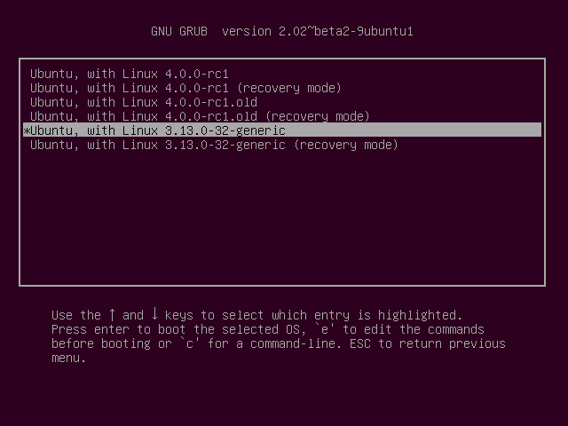
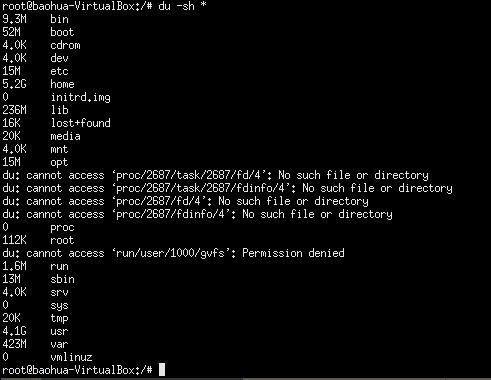
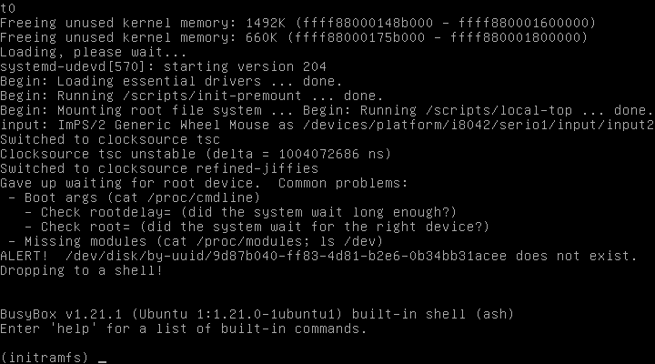

# Linux设备驱动的开发环境构建

## PC上的 Linux 环境

方案一：

* VMware
* ubuntu-14.04.6-desktop-amd64.iso

* 原先的.config配置文件不适配VMware环境，少了非常多驱动。磁盘都无法识别

方案二：

1. VirtualBox
2. 使用宝华虚拟机

* 可正常运行，但是虚拟机分配的硬盘空间真的好小

## QEMU实验平台

---
